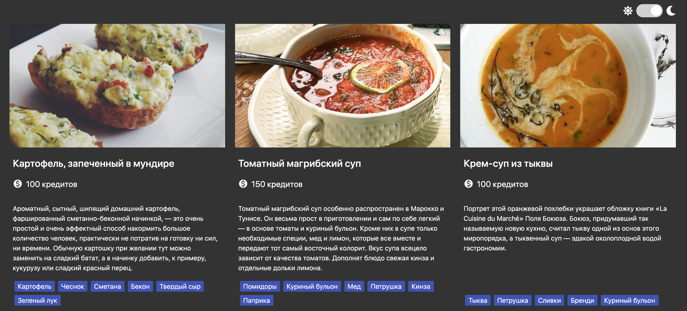
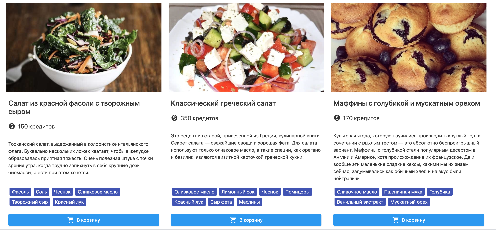

# Food-service

**The application with dishes recires that include a picture, recipe and ingredients. There is implemented a theme switcher(light and dark). Used a templating engine and web-storage for storing selected theme.**

[DEMO](https://elenvlass.github.io/goit-js-hw-10-food-service/)

#### dark theme 
#### light theme 
